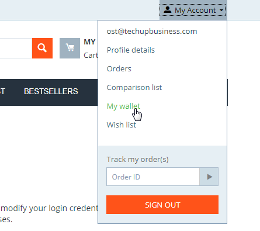

# OST Loyalty 2.0
OST Loyalty is an add-on for the e-commerce software [cs-cart](https://www.cs-cart.com) and enables store owners to create
and use their own customer loyalty points system on the blockchain with [OST Simple Token](https://www.ost.com).

**IMPORTANT:** The main-net is already live but not yet for the public. As soon as the main-net is live for the public (or the test-net allows new branded tokens), I will update this description with news instructions. In the meantime feel free to contact [ost.com](https://www.ost.com) to ask for an account.

Useful Links:
* [Youtube video 1](https://www.youtube.com/watch?v=BvM7vAmQnxg)
* [Youtube video 2](https://www.youtube.com/watch?v=VZjr30SPiFk)
* [CS Cart Marketplace](https://marketplace.cs-cart.com/add-ons/marketing/ost-loyalty-tokenized-customer-loyalty-program-based-on-blockchain.html)

Bitcoin and other crypto currencies are an interesting new way for exchanging assets between different parties. On the other hand customers really appreciate loyalty programs even though they need sometimes to give away their private data.
OST Simple Token is a side-blockchain based on Ethereum which makes it very easy to create your compliant custom token economy.

This integration into [CS-Cart](https://www.cscart.com) allows you to use your custom token economy based on OST Simple Token as a customer loyalty program.

## Main features
* Works with all (fiat) currencies (e.g. USD, EUR, ...) - USD is used just as an example in this "Features" section!!
* User can earn tokens as a percentage of their order volume (Example: 1% Loyalty Bonus = Tokens worth 1 USD for a 100 USD sales order will be sent to the users wallet) - store owners specify the percentage in the settings
* User can use these tokens based on their current value (in USD) like a gift certificate
* Store owners can create flexible marketing actions so users can earn more tokens as bonus
* Store owner can use the buyer account balance (in tokens) as a condition for flexible marketing actions
* Users see their wallet and can watch all transactions in their profile

# Contributions
Contributions are welcome! Please contact me if you want to implement OST Loyalty for other e-commerce system, this is very welcome to spread the adoption of crypto-currencies and OST.
In case you create an information page for your shoppers, I would be glad to add it as a default text to this addon.

# IMPORTANT preparation !!!
If you use this repository for your cs-cart installation make sure, that you check-out the library [OST Simple Token - KIT API - PHP Wrapper](https://github.com/TechupBusiness/ost-kit-php) into `app/addons/ost_loyalty/libs/SimpleTokenApi`, as it is a required core-part of this add-on.

# Add-On installation
If you just want to try it out: Download a CS-Cart copy from the official site, install and activate the demo licence, then 
download this add-on (you will find it on the [CS-Cart marketplace](https://marketplace.cs-cart.com/)) and extract it to your CS-Cart base folder 
(like any other cs-cart add-on).

The [CS-Cart Composer installation](https://github.com/TechupBusiness/cscart-composer) could make your life easier.

Afterwards you need to "install" it in your cs-cart admin backend. First click on `Add-ons`, then `Manage add-ons` and `Browse all available add-ons`
like seen on the following screenshot:

Now simply select `SimpleToken - OST Loyalty (TechupBusiness Addon)` and click install. After a short moment the page should refresh and you
will see a success message. The add-on is not yet active (status=disabled). Please follow the `Add-On setup` instructions below before you activate
OST Loyalty in your store.

# Add-On setup
## Connect to OST
First click on the add-on to show up the configuration dialog and enter your OST KIT **API Key** and **Secret**. The mode needs to be set to **Test** 
until the production side-chains go live.

There you need to enter your **API Key** and **Secret** that are provided in your 
[OST KIT Dashboard](https://kit.ost.com) under the Developer section:

## Configure loyalty bonus
Under your **API Key** and **Secret** you can set the following:
* User privacy: You can decide if you want to publish your users email address to the OST blockchain (as username) or not. Better keep the default "private".
* OST View links: If enabled, users have a link in their transaction history, to open the transaction in OST View, the blockchain explorer for the OST side-chain.

Now navigate to the `Configure actions` tab in the modal-popup dialog, to set (important, it has default values otherwise!):
* User registration reward (default 1 unit of your main currency): The amount in main your currency e.g. USD that a user should get in tokens (using the current exchange rate in USD at that time). Please see chapter about [fiat currencies](#fiat-currencies)). *Example: 1 (=1 USD in your tokens at the current exchange rate)*
* Percentage of user reward per currency unit (default 1 percent of the sales volume): Defines how much reward in percent a customer will get per main currency unit (e.g. 1 USD) for their sales orders. Example USD: Reward 1.0 would be a (later) payback of 1 cent for each spend 1 USD (from the buyers perspective it's a discount of 1 percent - assuming the same OST/USD exchange rate then - that he can claim with the next order). If the order is 100 USD, the user will get 1 USD in tokens to his wallet.

## Configure fiat currencies
In order to have correct values of your branded tokens in your store currencies, you need to always add USD as (at least as a hidden) currency in `Administration > Currencies`.
Because OST and the value of your branded tokens can be only determined in USD at the moment, we need the exchange rate of USD. Either you can use USD as your main currency, but it also works if you just use it as an additional currency.
In case the exchange rates from your main currency fluctuates strongly, you should use an [addon of cs-cart](https://marketplace.cs-cart.com/?subcats=Y&status=A&pshort=Y&pfull=Y&pname=Y&pkeywords=Y&search_performed=Y&cid=88&q=exchange+rate&dispatch=products.search) updating your fiat-exchange rates automatically.

Example: if you just want to sell in EUR, you simply add `USD` with its exchange rate `0.87` as a hidden additional currency. This way it doesn't appear in your store, but the calculations will work correctly for your branded tokens into `EUR`. The main currency `EUR` has always the lead then and is the exchange rate `1.0` master.

## Enable add-on
Now you are ready to enable the add-on! On the "Available add-ons" tab, enable OST Loyalty.

## Configure order statuses
First, [enable OST loyalty](#enable-addon), if not done yet. In order for the add-on to decide when to do the token transfers, we need to set-up the order statuses properly. 
The loyalty add-on allows two actions for each order status:
* **Deduct** for an order used tokens (as payment/discount) from a user (and give it to the merchant)
* **Grant** reward tokens for a sales order to the user (deducted from the merchant's wallet)

By default (without additional configuration) it is using the following logic for the default order statuses:

* *Open:* Deduct YES, Grant NO
* *Processed:* Deduct YEY, Grant NO
* *Complete:* Deduct YES, Grant YES
* *Failed:* Deduct NO, Grant NO
* *Declined:* Deduct NO, Grant NO
* *Backordered:* Deduct NO, Grant NO - you could consider setting deduct here also to YES
* *Canceled:* Deduct NO, Grant NO

Every time the order status changes and the grant/deduction state will change, the system will initiate a transaction. 

### Example(s)
A user is placing an order, using 50 BT (placeholder for your branded token) as a discount, for 100 USD (=already discounted amount) and would ger 1 USD in tokens, which is equivalent to (eg.) 200 BT. 
After placing the order is has the status **open** (=Deduct=YES, Grant=NO) which would deduct the 50 BT from his wallet. Now...

* **Scenario A:** Order changes from **open** to **complete** (Deduct=YES, Grant=YES): the 50 BT were already deducted in status **open**, so nothing will happen here. But only in the status **complete** the system grants the reward tokens for the user, so the system will initiate 200 BT as a transfer from the merchant to the users wallet.
* **Scenario B:** Order changes from **open** to **declined** (Deduct=NO, Grant=NO): the 200 BT were not granted yet, so nothing to do here. But the 50 BT were already deducted from the user, so the system will initiate reversion transfer and give the 50 BT back to the user (from the merchants wallet)

## Add wallet to store front-end
First, [enable OST loyalty](#enable-addon), if not done yet. By default the user can see his wallet and all transaction in his profile (after log-in).

In order to show up the wallet and it's balance on the front-end on each page directly, you need to place a wallet widget on your default page.

To do this, you in your admin backend to `Design > Layout` and add the OST Loyalty widget to your default page ("BT Wallet" on the screenshot).

After doing these steps, the wallet shows up on every page in the top bar:

## Add cron-jobs
First, [enable OST loyalty](#enable-addon), if not done yet. Now you need to know your cron-job password of CS-Cart which you can set/find in `Settings > Security settings`.
.

Now you can use the following cron-jobs (don't forget to replace the `{MY-PASS}` password and `{YOUR-DOMAIN}` in the URL). In case you don't have a cron-job on your server, you can use a free services like [cron-job.org](https://cron-job.org).
* **Update user balances** `https://{YOUR-DOMAIN}/admin.php?dispatch=ost_queue_cron.update_user_balances&pw={MY-PASS}`: Suggested interval is every 2 min. All information and the user balance is updating each time, a user clicks on his wallet. But because this leads often to too old information on the website, I highly suggest to set-up this cron-job for updating the information regularly.
* **Update BT exchange rate** `https://{YOUR-DOMAIN}/admin.php?dispatch=ost_queue_cron.update_currency_info&pw={MY-PASS}`: Suggested interval is every 5 min. This cron-job keeps your branded token exchange rate up-to-date, based on the current OST price. Don't forget to [set-up USD](#fiat-currencies) as a currency. **NOTE:** If you want to use the exchange rate for your branded tokens that you used to buy and stake the tokens (and don't care about the current exchange rate), don't use this cron-job!!! Why would you eventually like to do this? You can easily calculate everything in your books and you don't need to care about fluctuations (Example: a user spends 200 BT and gets a discount of 50 EUR, after a week these 200 BT that you received from your user are just worth 20 EUR - or 80 EUR at the time that you may convert them and send them to your bank-account).

# Whats next?
Now you can test the first transaction by registering a new user in your store. If you have a separate test-system or offline payment-methods, you could also try an example order to see if the wallet reflects everything correctly.
In addition you should create an information page, informing your users about your new loyalty program (if possible a contribution of the information page to this project would be awesome).

## Use marketing promotions
To learn how to use marketing promotions in CS-Cart please see:

* [Youtube series about CS-Cart promotions](https://www.youtube.com/watch?v=Fc2iyi0O0-I)
* [Documentation - User Guide - Promotions](https://docs.cs-cart.com/4.8.x/user_guide/manage_products/promotions/index.html)

### Branded tokens as condition
You can use the amount of collected branded tokens as a condition for your marketing promotions. For example user with more than x tokens will have free shipping on their orders in the christmas time.
Or user with more than x token will get a special user-group which gives them other advantages.

### Branded tokens as bonus
Here you can give tokens to users based on a condition. For example if a user enters a specific coupon code on check-out, he will get additional x tokens as a bonus. This will be visible to the user in the order summary while doing the check-out.

# Known issues
- Deletion of orders that had previously the state **Deduct** or **Grant** on YES, does not revert the token transfer (only setting a proper status can revert the transaction - please see section [Configure order statuses](#order-status) above)